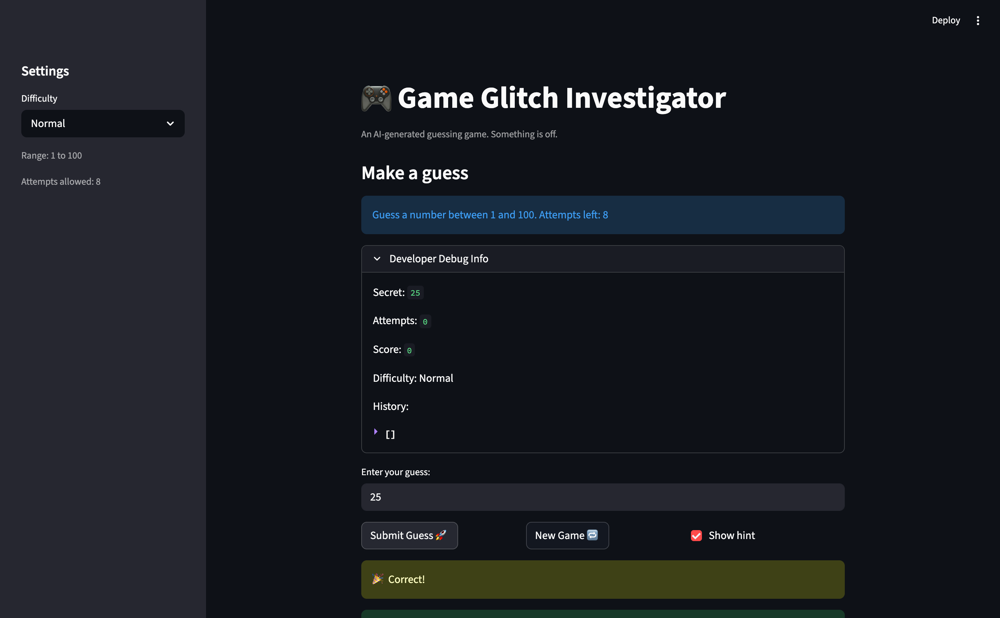
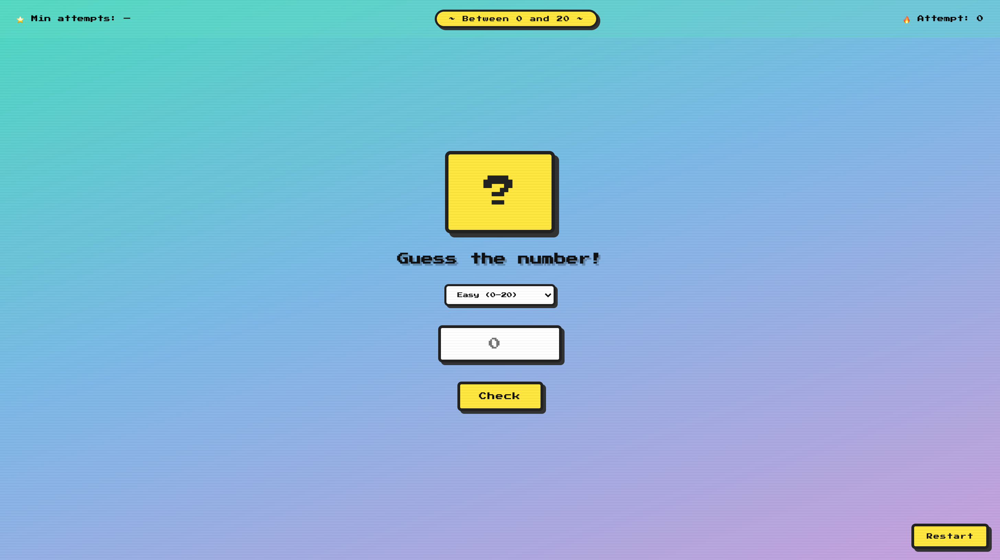
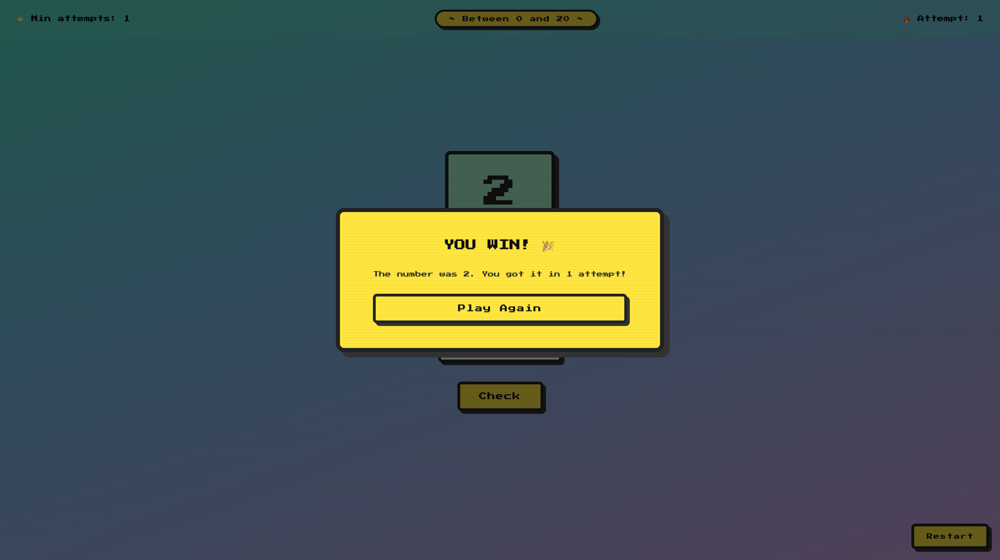

# 🎮 Game Glitch Investigator: The Impossible Guesser

## 🚨 The Situation

You asked an AI to build a simple "Number Guessing Game" using Streamlit.
It wrote the code, ran away, and now the game is unplayable.

- You can't win.
- The hints lie to you.
- The secret number seems to have commitment issues.

## 🛠️ Setup

1. Install dependencies: `pip install -r requirements.txt`
2. Run the broken app: `python -m streamlit run app.py`

## 🕵️‍♂️ Your Mission

1. **Play the game.** Open the "Developer Debug Info" tab in the app to see the secret number. Try to win.
2. **Find the State Bug.** Why does the secret number change every time you click "Submit"? Ask ChatGPT: *"How do I keep a variable from resetting in Streamlit when I click a button?"*
3. **Fix the Logic.** The hints ("Higher/Lower") are wrong. Fix them.
4. **Refactor & Test.** - Move the logic into `logic_utils.py`.
   - Run `pytest` in your terminal.
   - Keep fixing until all tests pass!

## 📝 Document Your Experience

- [x] **Game's purpose:** A number guessing game where the player tries to guess a randomly chosen secret number using Higher/Lower hints within a limited number of attempts. A score system rewards faster wins.

- [x] **Bugs found:**
  - **State Bug** — The secret number regenerated on every Streamlit rerun (every button click), so the target kept changing and the player could never win.
  - **Logic Bug (hints backwards)** — `check_guess()` returned `"Too High"` when the guess was too low and `"Too Low"` when it was too high, completely misleading the player.
  - **Type-flip Bug** — On even-numbered attempts the secret was cast to a string, making comparisons lexicographic instead of numeric (e.g. `"9" > "50"` is `True`), giving wrong hints every other guess.
  - **Range Bug** — Hard mode used range `(1, 50)`, which is smaller than Normal's `(1, 100)`, making Hard actually easier.

- [x] **Fixes applied:**
  - Wrapped `secret` in `st.session_state` so it persists across reruns.
  - Corrected the `>` / `<` comparison in `logic_utils.py` so hints match the actual guess direction.
  - Removed the string cast entirely so the secret stays an `int` throughout.
  - Documented the range issue with `FIXME` comments in the code.

## 📸 Demo

## 🚀 Stretch Features

### Challenge 4 — Enhanced Retro UI (`index.html`)

A standalone HTML + CSS + JS game with a retro 8-bit arcade style. Open `index.html` with VS Code Live Server or run `python -m http.server 5500` and visit `http://127.0.0.1:5500/index.html`.

**Features added:** retro pixel font (Press Start 2P), mystery card that flips on a correct guess, CRT scanline overlay, HUD bar (range / attempt count / personal best), difficulty selector (Easy 0–20 / Normal 0–100 / Hard 0–200), shake animation on wrong guesses, win overlay pop-up, and Enter-key support.

